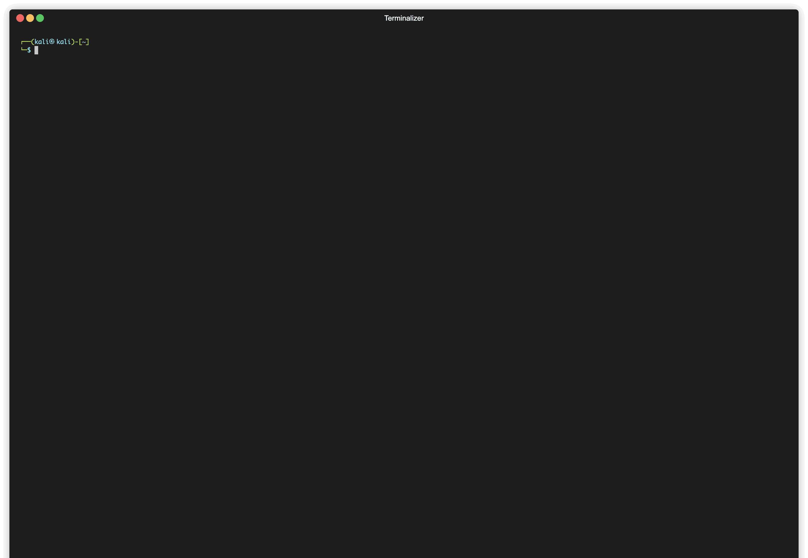

# NvChad-custom
自定义neovim配置,基于 [NvChad](https://github.com/NvChad/NvChad) 和  [elulcao](https://github.com/elulcao/NvChad-custom)
<details>
<summary>查看演示图</summary>

</details>

支持 html  js typescript golang rust python lua 等语言的lsp   
支持 copilot  代码提示   
## 修改点
- 增加插入模式自动判断fctix5输入法的开关，离开插入模式自动关闭输入法
## todo list:
- 快捷键的的整理

## Pre-requisites

### Neovim - debian12 
```bash
sudo apt install ripgrep
sudo wget -c https://github.com/neovim/neovim/releases/download/nightly/nvim.appimage -O /opt/nvim.appimage
sudo chmod +x  /opt/nvim.appimage
#echo "alias nvim='/opt/nvim.appimage'" >>~/.zshrc #or ~/.bashrc 自己配置一下
# 字体 
wget https://github.com/ryanoasis/nerd-fonts/releases/download/v3.1.1/JetBrainsMono.zip
unzip JetBrainsMono.zip
sudo mkdir  /usr/share/fonts/nerd 
sudo cp ./*.ttf /usr/share/fonts/nerd/
fc-cache -f
```

### 安装NvChad以及清理
记得备份
```bash
rm -rf ~/.cache/nvim ~/.local/share/nvim/ ~/.config/nvim  ~/.config/nvim-NvChad-custom
git clone https://github.com/NvChad/NvChad ~/.config/nvim --depth 1

```
## 启用自定义配置

```bash
git clone https://github.com/joyanhui/nvim-NvChad-custom.git ~/.config/nvim-NvChad-custom  --depth 1
ln -sf ~/.config/nvim-NvChad-custom/lua/custom $HOME/.config/nvim/lua/
nvim
```
